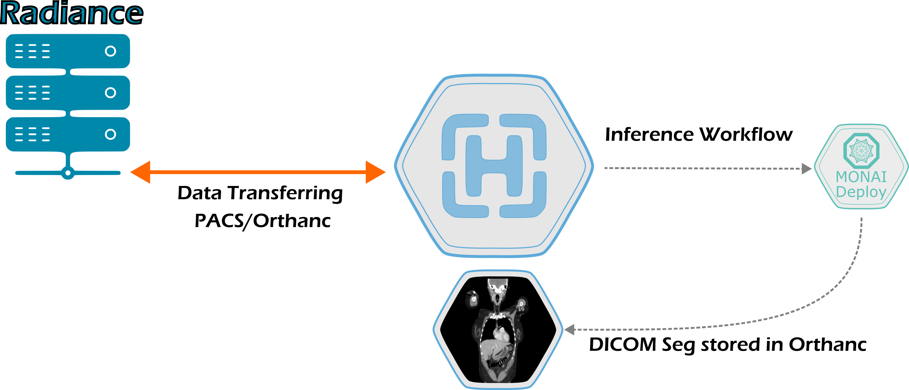

# Automatic Segmentation with Orthanc

    

This section describes the workflow for automatic segmentation of DICOM images using the Orthanc server. The model is assumed to be already packaged and deployed to the MAIA platform, available through XNAT.

## Workflow
The workflow for automatic segmentation of DICOM images using the Orthanc server is as follows:
1. Upload the DICOM images to the Orthanc server using the Orthanc web interface or the DICOMweb API.
2. From the Orthanc web interface, select the DICOM images you want to segment and send them to the DICOM Node linked to XNAT.
3. XNAT wil receive the DICOM images and automatically trigger the segmentation model to perform the segmentation, sending the results back to the Orthanc server.
4. The segmented images will be available in the Orthanc web interface, where you can view and manually refine the segmentation results.