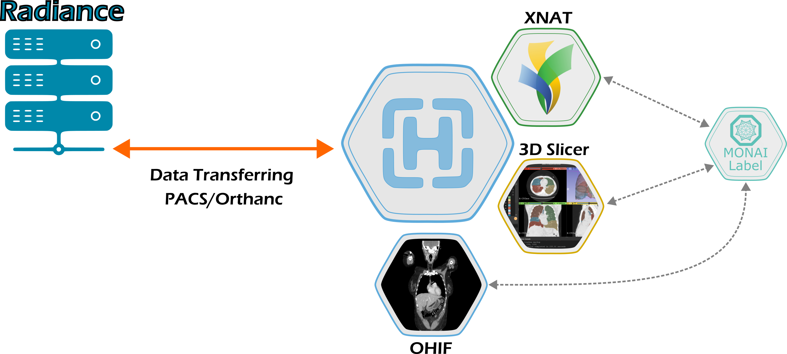

# MAIA Tutorials and Examples

    

This is a repo collection of tutorials and examples for MAIA, a platform for designing, developing, and deploying AI applications in the medical domain. The goal of this repository is to provide a comprehensive set of examples that demonstrate the capabilities of MAIA and how to use it effectively.

The tutorials and examples are organized into different folders based on the type of application or use case. Each folder contains a README file that provides an overview of the examples in that folder, as well as instructions on how to run them.

## Getting Started

The only requirement to run the examples is to have an active MAIA account linked with a project. You can sign up for an account at [MAIA Account](https://maia.app.cloud.cbh.kth.se/maia/register/), while  the project can be requested at [MAIA Project](https://maia.app.cloud.cbh.kth.se/maia/register_project/).

For more information on how to use MAIA, please refer to the official documentation at [MAIA Intro](https://kthcloud.github.io/Computer-Science-Workshop/Day1/MAIA-Intro/).

    

## Access to MAIA Workspace

To access the MAIA Workspace, three different options are available:

1. Jupyter
2. SSH
3. Remote Desktop

The Jupyter link is available in the project page in the MAIA dashboard. 
The SSH and Remote Desktop links are also available in the project page in the MAIA dashboard, but they are only available for users with a project that has been granted access to these features.

The SSH access to the MAIA workspace is only granted with a key pair. If you do not have a key pair, you can follow the instructions in the [SSH Access](https://github.com/kthcloud/MAIA/blob/master/docker/MAIA-Workspace/Welcome.ipynb) tutorial to create one.
If you already have a key pair, you can upload the public key to the MAIA Workspace by following the instructions in the [SSH Access](https://github.com/kthcloud/MAIA/blob/master/docker/MAIA-Workspace/Welcome.ipynb) tutorial.

## Model Development
[...]
## Model Deployment
After the model development phase, the model can be packaged and deployed to the MAIA platform to be used for inference on new incoming data. 

The deployment process involves creating a Docker image of the model and pushing it to a container registry, which can be accessed by the MAIA platform. 

The containerized application should handle the model prediction internally, receiving the input data and returning the output predictions in a format that can be easily consumed by the MAIA platform (DICOM, NIfTI, etc.).
The entrypoint of the containerized application should be a Python script that handles the input and output data, as well as any necessary preprocessing and postprocessing steps (see the [nnU-Net MONAI Bundle](https://github.com/SimoneBendazzoli93/nnUNet-MONAI-Bundle/tree/main/deploy/spleen-x64-workstation-dgpu-linux-amd64%3A1.0) for an example).
### nnU-Net Based Segmentation Models
If you want to package and deploy a nnU-Net based segmentation model, you can follow the instructions in the [nnU-Net MONAI Bundle](https://github.com/SimoneBendazzoli93/nnUNet-MONAI-Bundle) GitHub repo.
This repo provides a step-by-step guide on how to package and deploy a nnU-Net based segmentation model, ready to be consumed. The application is relying on the nnU-Net framework, together with the MONAI framework, including MONAI Bundle and MONAI Deploy, to provide a complete solution for deploying segmentation models in the MAIA platform.

## DICOM and NIfTI Upload

This section provides a tutorial on how to upload DICOM and NIfTI files to the MAIA platform. The tutorial covers the following topics:
1. [Uploading DICOM files to Orthanc](Orthanc/README.md)
2. [Uploading NIfTI files to MinIO](MinIO/README.md)

## Image Visualization

    

This section provides a tutorial on how to visualize DICOM and NIfTI files using the MAIA platform.
The images can be visualized using the OHIF Viewer, which is a web-based DICOM viewer that is integrated into the MAIA platform. The OHIF viewer allows you to view and annotate DICOM images, as well as perform basic image processing tasks. 
Additionally, the images can be visualized using any other DICOM viewer that can be accessed through the Remote Desktop, including 3D Slicer, ITK-SNAP, MITK and NAPARI.

To connect the Remote 3D Slicer to Orthanc, you can follow the instructions in the [3D Slicer DICOM](https://slicer.readthedocs.io/en/latest/user_guide/modules/dicom.html) documentation.
Additionally, you can use the 3D Slicer DicomWeb extension to connect the 3D Slicer to the Orthanc DICOM server. The extension can be installed from the 3D Slicer Extension Manager, and it allows you to connect to the Orthanc DICOM server using the DICOMweb protocol.

## Image Annotation
[...]

## Automatic Segmentation Workflow

If you have a trained model, you can deploy it following the instructions in the [Model Deployment](#model-deployment) section.
This section provides the instructions on how to use the deployed model to perform automatic segmentation on DICOM and NIfTI files. The tutorial covers the following topics:
1. [Automatic Segmentation of DICOM files from Orthanc](Orthanc/AutoSegmentation.md)
2. [Automatic Segmentation of NIfTI files from MinIO](MinIO/AutoSegmentation.md)